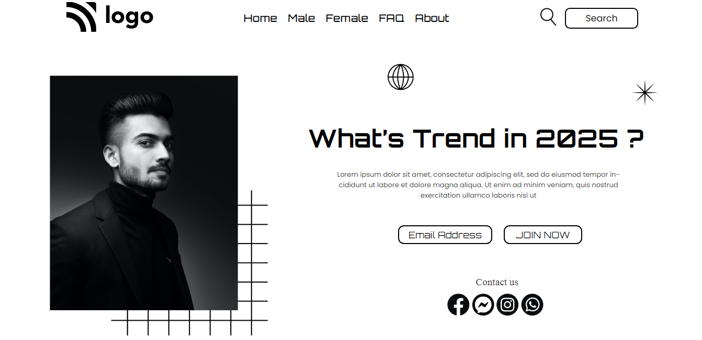

# Project - 01

### What's Trend In 2025 (Landing Page)

---

## About project
---

This Project Is Created Using Html & CSS Only. Various Html & CSS Property are Used To Make This Landing Page Delightful.

---

## Learning Experience
---

This Is My Very First Project That Teach Me a Lot About How to Really Think And Put It Into a Code...That Makes Out-Put Pretty Decent. I Also Find Out That What Only `CSS` Can Do,
And How Much it is Important to Learn Basics Of `CSS` Very Well.

`### How Much Time I Took To Finish This Project...?` Overall it Took me a `24 hours` to Commplete This Project, `yes you read that Correct 24 hours`, So Much Try & Erorr, So much to Learn. After Finishing this I Feel So much Confident to Build Other Projects and Explore More.

---

##  Special Thanks To : [Hitesh Choudhary Sir](https://www.instagram.com/hiteshchoudharyofficial/?hl=en)  And [Ineuron](https://ineuron.ai/course/Full-Stack-Javascript-Web-Developer)

>Thank You Very Much For This Amazing Course.

---

## Screenshot 

[Live Link]()

---

>## Who Am I ?

>My Name Is Karan I am A Learner Who is Interested in Sharing Knowledge About The Skills I'm Developing to Become a Full-Stack Web Developer.

>## Check Out My Work on 

>[Netlify](https://app.netlify.com/teams/karan9846/overview?_ga=2.175703073.206776847.1659963657-634189433.1659791041)

>[FindCoder](https://www.findcoder.io/u/karan18)

>[hashnode](https://hashnode.com/@karan787)

>Let's get Connected [@karanjaria](https://www.instagram.com/karanjaria/?hl=en)

